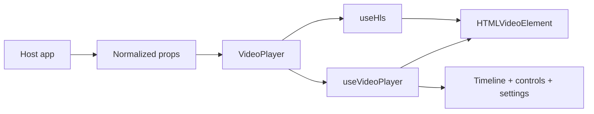

# Architecture

## Package Boundary

`@mmmihaeel/custom-video-player` keeps the public surface intentionally small:

- normalized media input comes from the host app
- fetching and data mapping stay outside the package
- the package owns playback controls, timeline behavior, settings, and media orchestration

## Internal Modules

| Path                                    | Role                                                                          |
| --------------------------------------- | ----------------------------------------------------------------------------- |
| `src/components/VideoPlayer.tsx`        | Public component and control composition                                      |
| `src/components/VideoPlayer.module.css` | Encapsulated player styling                                                   |
| `src/hooks/useHls.ts`                   | HLS runtime loading, retries, and quality switching                           |
| `src/hooks/useVideoPlayer.ts`           | Media lifecycle, settings state, timeline interaction, and keyboard shortcuts |
| `src/hooks/useFullscreen.ts`            | Fullscreen state synchronization                                              |
| `src/hooks/usePictureInPicture.ts`      | Picture-in-Picture capability and state synchronization                       |
| `src/utils/*`                           | Pure helpers for formatting, clamping, chapters, and quality mapping          |

## Runtime Flow

## Guardrails

- The package accepts normalized props only.
- Timeline interaction is implemented with semantic `div`-based behavior instead of a native range input.
- Styling ships through CSS Modules to stay decoupled from any UI framework.
- Host apps decide where media data comes from and how playback events are consumed.
