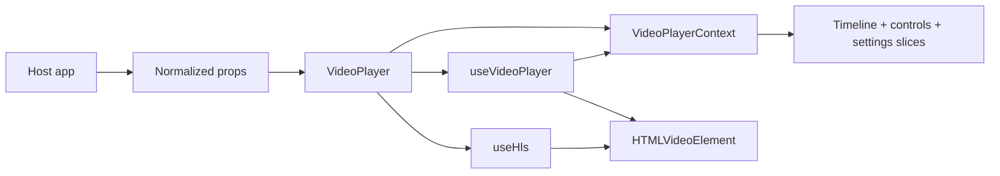

# Architecture

## Package Boundary

`@mmmihaeel/custom-video-player` keeps the public surface intentionally small:

- normalized media input comes from the host app
- fetching and data mapping stay outside the package
- the package owns playback controls, timeline behavior, settings, and media orchestration

## Internal Modules

| Path                                          | Role                                                                                   |
| --------------------------------------------- | -------------------------------------------------------------------------------------- |
| `src/components/VideoPlayer.tsx`              | Public entrypoint that wires props, HLS transport, runtime orchestration, and context  |
| `src/context/VideoPlayerContext.tsx`          | Internal runtime distribution layer with focused state/control/timeline/settings hooks |
| `src/components/VideoPlayerLayout.tsx`        | Root shell composition for surface, status states, and overlays                        |
| `src/components/VideoPlayerTimeline.tsx`      | Timeline UI consuming the timeline slice                                               |
| `src/components/VideoPlayerControls.tsx`      | Control row consuming playback and audio slices                                        |
| `src/components/VideoPlayerSettingsMenu.tsx`  | Layered settings surface consuming the settings slice                                  |
| `src/components/VideoPlayerCenterOverlay.tsx` | Center play/replay overlay consuming playback state                                    |
| `src/components/VideoPlayer.module.css`       | Encapsulated player styling                                                            |
| `src/hooks/useHls.ts`                         | HLS runtime loading, retries, and quality switching                                    |
| `src/hooks/useVideoPlayer.ts`                 | Single source of truth for media lifecycle, settings state, analytics, and interaction |
| `src/hooks/useFullscreen.ts`                  | Fullscreen state synchronization                                                       |
| `src/hooks/usePictureInPicture.ts`            | Picture-in-Picture capability and state synchronization                                |
| `src/utils/*`                                 | Pure helpers for formatting, clamping, chapters, and quality mapping                   |

## Runtime Flow

## Context-Based Composition

`useVideoPlayer` remains the only runtime authority for player state and actions. The context layer is intentionally distribution-only:

- it exposes focused slices to smaller UI components
- it avoids threading a wide `player` object through every render branch
- it does not duplicate media state or create a second store

The render tree consumes focused hooks rather than broad prop objects:

- `useVideoPlayerState()`
- `useVideoPlayerControls()`
- `useVideoPlayerTimeline()`
- `useVideoPlayerSettings()`
- `useVideoPlayerCallbacks()`

This keeps future growth manageable without widening the public package API.

## Analytics Architecture

Typed analytics live in the runtime layer, not in the UI leaf components:

- the public prop is `onAnalyticsEvent`
- the contract is the discriminated `AnalyticsEvent` union
- event emission happens inside `useVideoPlayer`, alongside existing host callbacks
- UI components remain presentation-focused and do not know about analytics vendors or network logic

That placement keeps the analytics surface strongly typed, host-agnostic, and easy to extend as new playback interactions are added later.

## Guardrails

- The package accepts normalized props only.
- Timeline interaction is implemented with semantic `div`-based behavior instead of a native range input.
- Styling ships through CSS Modules to stay decoupled from any UI framework.
- Host apps decide where media data comes from and how playback and analytics events are consumed.
- The context layer is internal and exists to reduce prop drilling, not to expand the public API surface.
