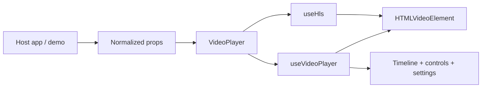

# Architecture

## Workspace Boundary

| Layer                          | Responsibility                                                                   |
| ------------------------------ | -------------------------------------------------------------------------------- |
| `packages/custom-video-player` | Player UI, media runtime integration, timeline logic, styles, and exported types |
| `apps/demo`                    | Showcase layout, demo fixture data, and deployment-specific configuration        |
| `.github/workflows`            | Validation and GitHub Pages deployment                                           |

## Internal Package Modules

| Path                                    | Role                                                                          |
| --------------------------------------- | ----------------------------------------------------------------------------- |
| `src/components/VideoPlayer.tsx`        | Public component and control composition                                      |
| `src/components/VideoPlayer.module.css` | Encapsulated player styling                                                   |
| `src/hooks/useHls.ts`                   | HLS runtime loading, retries, and quality switching                           |
| `src/hooks/useVideoPlayer.ts`           | Media lifecycle, settings state, timeline interaction, and keyboard shortcuts |
| `src/hooks/useFullscreen.ts`            | Fullscreen state synchronization                                              |
| `src/hooks/usePictureInPicture.ts`      | Picture-in-picture capability and state synchronization                       |
| `src/utils/*`                           | Pure helpers for formatting, clamping, chapters, and quality mapping          |

## Runtime Flow

## Guardrails

- The package accepts normalized props only.
- Fetching and data mapping stay in the host app or demo.
- The timeline is implemented with semantic div-based interaction rather than a native range input.
- Styling is delivered through CSS Modules to avoid coupling to a UI framework.
